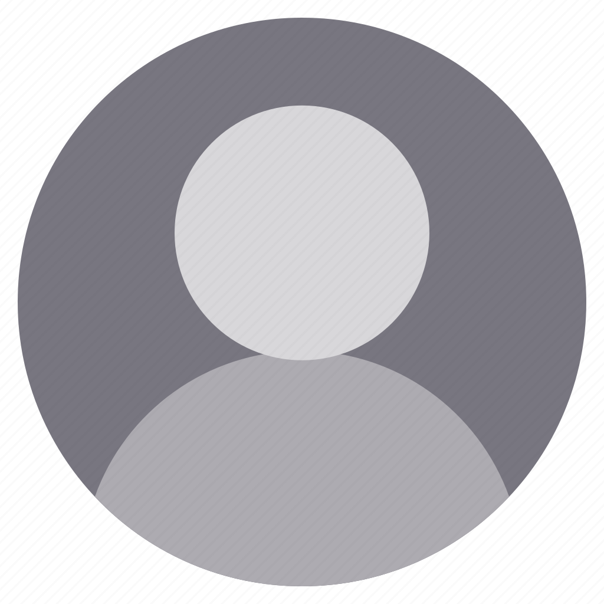

# Документація мого сайту

## Цей сайт зроблений на тему фітнесу і зроблений з цілю відточити мої навички ванільного JS

> ### На цьому сайті в мові розмітки HTML (Hyper Text Language) складається з стандартноі розмітки з ванільною структурою

```html
<header>...</header>
<section>...</section>
<section>...</section>
<section>...</section>
<section>...</section>
<footer>...</footer>
```

### В header є burger-menu

```html
<header class="header container">
  <div class="header-main">
    <button class="menu-button" id="btn-menu">
      <span class="bar"></span>
      <span class="bar"></span>
      <span class="bar"></span>
    </button>
    <nav class="navigation" id="navigation">
      <div class="header-icons">
        
        <h1 class="logo">FitnessProgram</h1>
      </div>
      <ul class="nav-list">
        <li class="nav-item"><a href="#">Тренування</a></li>
        <li class="nav-item"><a href="#">Їжа</a></li>
        <li class="nav-item"><a href="#">Асортимент</a></li>
        <li class="nav-item"><a href="#">Калорії</a></li>
      </ul>
      <article class="nav-info">
        
        <h3 class="nav-title" id="firstUserName">Імя</h3>
        <h3 class="nav-title" id="firstUserGender">Гендер</h3>
        <h3 class="nav-title" id="firstUserHeight">Ріст</h3>
        <h3 class="nav-title" id="firstUserWeight">Вага</h3>
      </article>
    </nav>
  </div>
</header>
```

```css
header {
  flex-wrap: wrap;
  background-color: rgb(37, 37, 37);

  .menu-button {
    flex-wrap: wrap;
    display: flex;
    flex-direction: column;
    justify-content: space-between;
    align-items: center;
    width: 30px;
    height: 22px;
    background: transparent;
    border: none;
    cursor: pointer;
    position: relative;
    margin-top: 1.5vw;

    .bar {
      display: block;
      width: 3vw;
      height: 0.3vw;
      border-radius: 5px;
      background-color: white;
      transition: all 0.3s ease;
    }

    &.open-birger-menu {
      .bar {
        background-color: #757575;
      }

      .bar:nth-child(1) {
        transform: rotate(50deg) translateY(14px);
      }

      .bar:nth-child(2) {
        display: none;
      }

      .bar:nth-child(3) {
        transform: rotate(-50deg) translateY(-14px);
      }
    }

    &:hover .bar {
      background-color: #555;
    }
  }

  .header-main {
    flex-wrap: wrap;
    display: flex;
    justify-content: space-between;
    align-items: center;
    padding: 1vw;

    .navigation {
      display: flex;
      flex-wrap: wrap;
      align-items: center;
      gap: 1vw;

      .header-icons {
        flex-wrap: wrap;
        font-family: "Gill Sans", "Gill Sans MT", Calibri, "Trebuchet MS",
          sans-serif;
        display: flex;
        align-items: center;
        padding-left: 5vw;
        color: white;
        gap: 3vw;

        .logo {
          padding-top: 2vw;
          font-size: 2rem;
        }
      }

      .nav-list {
        font-family: "Lucida Sans", "Lucida Sans Regular", "Lucida Grande",
          "Lucida Sans Unicode", Geneva, Verdana, sans-serif;
        display: flex;
        flex-wrap: wrap;
        padding-top: 2vw;
        font-size: 1.5rem;
        gap: 2vw;

        .nav-item:hover {
          color: red;
        }
      }

      .nav-info {
        padding-top: 2vw;
        display: flex;
        flex-wrap: wrap;
        border: 1vw;

        .nav-title {
          font-family: "Gill Sans", "Gill Sans MT", Calibri, "Trebuchet MS",
            sans-serif;
          margin-left: 1vw;
          font-size: 1.5rem;
          color: white;
        }
      }
    }
  }
}
```

```javascript
const menuButton = document.getElementById("btn-menu");
const menu = document.getElementById("navigation");

function burgerMenu() {
  menuButton.classList.toggle("open-birger-menu");
  if (menu.style.display === "none") {
    menu.style.display = "flex";
  } else {
    menu.style.display = "none";
  }
}

menuButton.addEventListener("click", burgerMenu);
```

### А також використовується простий паралакс еффект
>
```css
.bg-image {
  height: 25vw;
  width: 100%;
  background: url(https://images.fitnessintl.com/images/CMS/LAF/Amenities/blogimage.jpg);
  background-attachment: fixed;
  background-position: center;
  background-repeat: no-repeat;
  background-size: cover;
}
```

___
# Про Функціонал Сайту
> ### В самому сайті дуже часто використовується ванільний JS. А точніше 
>>
```js
const technology = ['ООП', 'Всі види функцій', 'Метод масиву forEach', 'Та достатньо непоганим створенням та шифруванням паролю', 'А також DOM' ]
```
>
___
# Про SCSS
> ### На сайті використовується SCSS тут достатньо багато коду який сприяє гарному вигляду сайту
>> #### В найблищий час код scss оновиться та додадуться міксіни в сайта прекрасний виглад завдяки сотням строкам коду як ідобре працюють з функціоналом JS